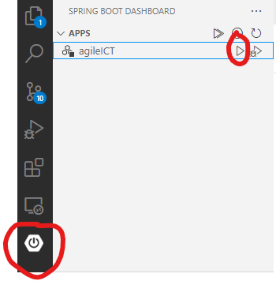

# ISST-Grupo01-Caso-25

# De momento para ejecutar el frontend:

```
cd agileICT/frontend
npm install
yarn
yarn run dev 
```

Una vez instalado, el resto de veces:
```
yarn run dev
```
Y estará disponile en http://localhost:5173

# De momento para ejecutar el backend:

#### Ejecutar el proyecto Spring Boot:
Dos opciones:

Desde la carpeta donde está el pom.xml (/agileICT): 
```
./mvnw clean install spring-boot:run -DskipTests=true
```

ó

Ir al SpringBoot DashBoard (extensión de vscode) y darle a run:



# De momento para acceder a la base de datos:

Con el backend ejecutándose:

### Acceder a la consola web de H2:

http://localhost:8080/h2-console

### Acceder a la base de datos H2:

Susituir URL JBDC por: jdbc:h2:file:~/agileICT

# Para ejecutar todo el proyecto:

Inicializar frontend y backend a la vez