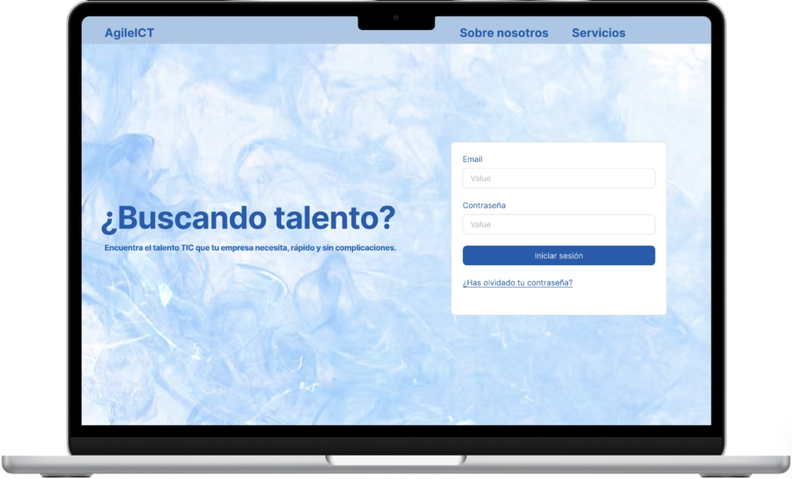
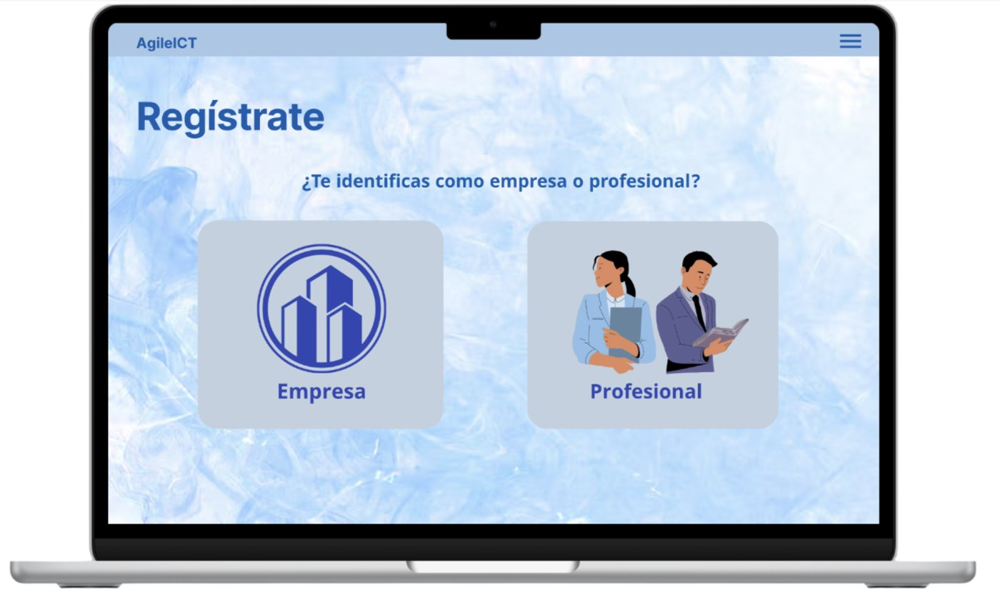
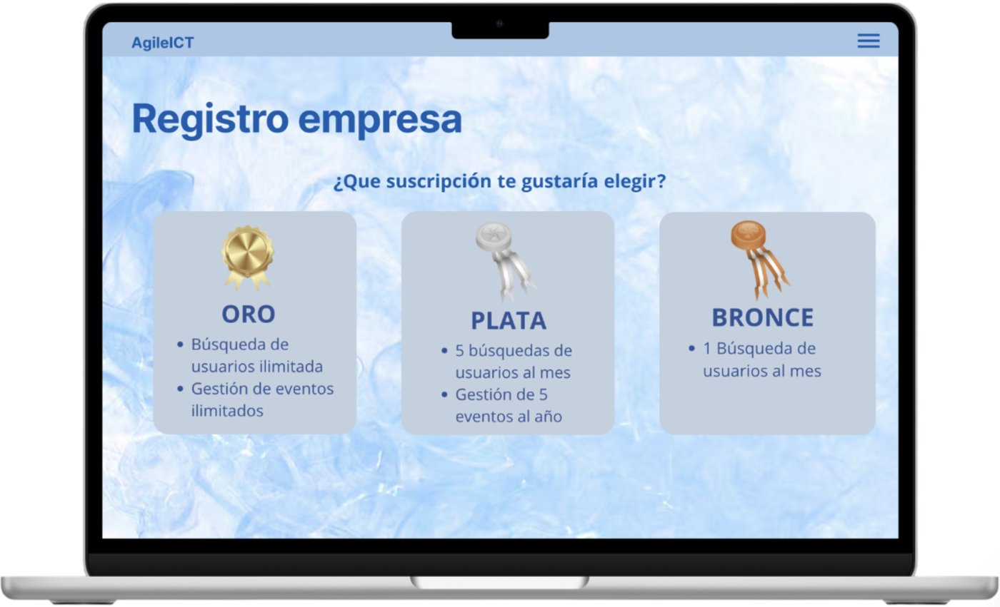
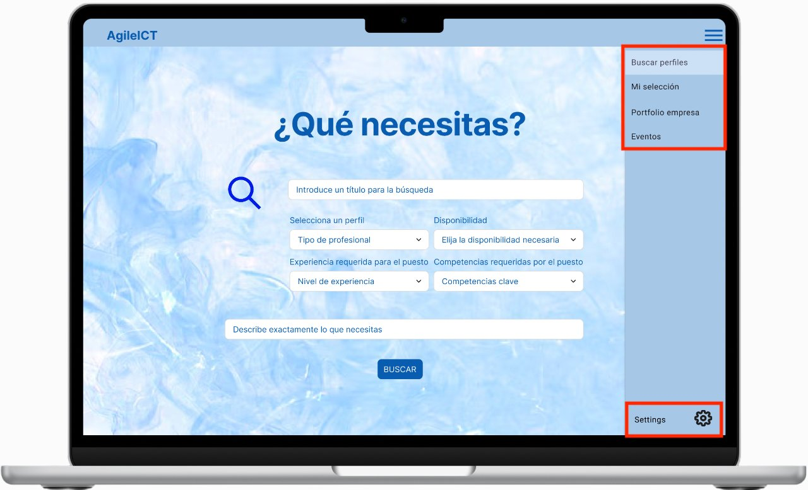
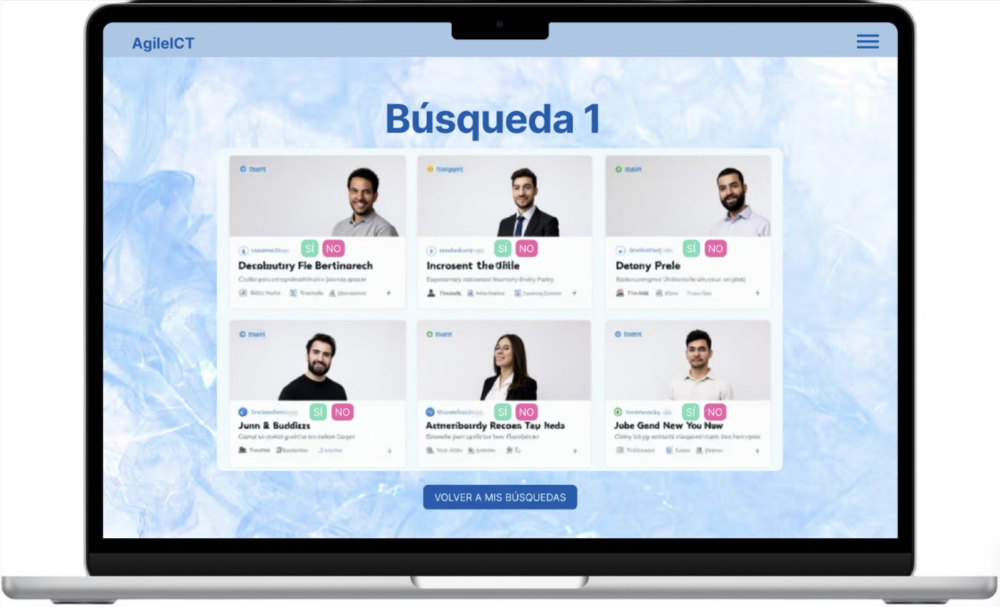
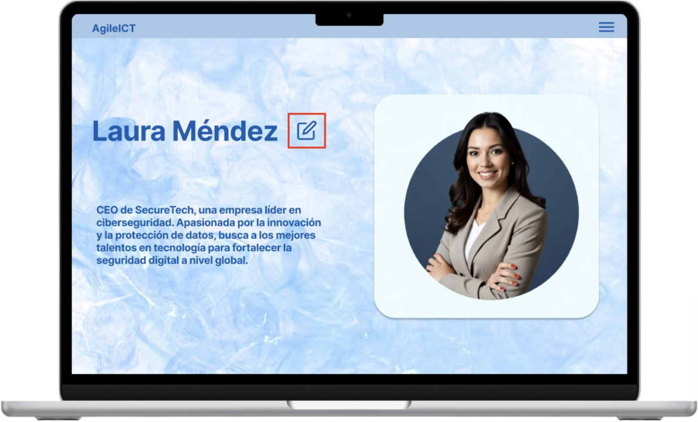

# agileICT: headhunting platform for ICT professionals

A full-stack web platform that connects ICT professionals with companies. Professionals publish their profile and say whether they are open to offers. Companies sign up, choose a subscription plan and describe the profile they are looking for.

Built by a 5-person Scrum team for *Telematic Systems & Services Engineering* (ISST), B.Eng. in Telecommunication Technologies and Services, Universidad Politécnica de Madrid (spring 2025).

▶ **[Demo video](https://youtu.be/o9tevRGyyHM)**

## Features

- Role-based sign-up for **professionals** and **companies**, with subscription plan selection
- Login and session handling (log in / log out from the navbar)
- Professional profile: view, **edit** and toggle "open to offers" availability
- **Search requests**: a company describes the professional it needs (type, availability, experience level, key skills, detailed description) and the request is stored and listed through the API

## My contributions (Gonzalo Leis Varela)

| What | Where | Commit |
|---|---|---|
| **Search requests, end to end**: `Busqueda` JPA entity (many-to-one with `Company`), repository, `POST /busquedas/registrar` and `GET /busquedas` endpoints, and the company search form in React that implements the *"¿Qué necesitas?"* mockup | [`BusquedaController.java`](agileICT/src/main/java/es/upm/dit/isst/agileICT/controller/BusquedaController.java), [`Busqueda.java`](agileICT/src/main/java/es/upm/dit/isst/agileICT/entity/Busqueda.java), [`InicioEmpresa.jsx`](agileICT/frontend/src/components/InicioEmpresa.jsx) | [`1a1e70e`](https://github.com/gonzaloleis/agileict-headhunting-platform/commit/1a1e70e45419524c1c7b18774f7a5e40d8c1a7ac) |
| **Professional profile update**: the field-by-field (partial) update logic of `PUT /api/professionals/{id}`, and the related changes to the `Professional` entity | [`ProfessionalController.java`](agileICT/src/main/java/es/upm/dit/isst/agileICT/controller/ProfessionalController.java), [`Professional.java`](agileICT/src/main/java/es/upm/dit/isst/agileICT/entity/Professional.java) | [`abc824b`](https://github.com/gonzaloleis/agileict-headhunting-platform/commit/abc824bf9b8178c27b22c12af57d9d440f5a7772), [`de2855a`](https://github.com/gonzaloleis/agileict-headhunting-platform/commit/de2855a93aa3a95a8f93940b2e3909e06594e579) |
| **UI design**: co-designed the mockups below with the team, and worked on UML diagrams and user stories during the Scrum sprints | [`docs/mockups`](docs/mockups) | |

## Design

Mockups designed by the team in the first sprint (March 2025), before any code was written. All 12 screens are in [`docs/mockups`](docs/mockups).

| | |
|---|---|
|  |  |
| **Login** | **Sign up as company or professional** |
|  |  |
| **Company subscription plans** | **Company search request ("¿Qué necesitas?")** |
|  |  |
| **Candidates for a search** | **Professional profile** |

## Tech stack

| Layer | Technology |
|---|---|
| Backend | Java 17, Spring Boot 3.4, Spring Data JPA, Maven |
| Database | H2 (file-based, `~/agileICT`) |
| Frontend | React 19, React Router, Vite, Axios |
| Process | Scrum, user stories, UML |

## Architecture

```
React SPA (Vite, :5173)  --HTTP/JSON-->  Spring Boot REST API (:8080)  --JPA-->  H2 database
```

Backend packages under `agileICT/src/main/java/es/upm/dit/isst/agileICT/`:

- `entity/`: `Professional`, `Company`, `Busqueda` (search request, many-to-one with `Company`)
- `repository/`: Spring Data JPA repositories
- `controller/`: REST controllers

### REST API

| Method | Endpoint | Description |
|---|---|---|
| POST | `/api/professionals/register` | Register a professional |
| GET | `/api/professionals/{id}` | Get a professional profile |
| PUT | `/api/professionals/{id}` | Update a professional profile |
| POST | `/api/companies/register` | Register a company |
| POST | `/api/login` | Log in (professional or company) |
| POST | `/busquedas/registrar` | Create a search request for a company |
| GET | `/busquedas` | List search requests |

## Running locally

Requirements: JDK 17+, Node.js 18+.

```bash
# Backend (http://localhost:8080)
cd agileICT
./mvnw spring-boot:run

# Frontend (http://localhost:5173), in another terminal
cd agileICT/frontend
npm install
npm run dev
```

H2 console: http://localhost:8080/h2-console (JDBC URL `jdbc:h2:file:~/agileICT`, user `sa`, empty password).

## Team

María Barragán Gámiz, Elena Barrio Maceira, Sandra González Chamoso, Gonzalo Leis Varela and Juan Diego Molero García-Morato.

The full commit history of the team repository is preserved here, so every member's work can be traced. My part is summarised in [My contributions](#my-contributions-gonzalo-leis-varela).

## Known limitations

This is a course prototype: passwords are stored in plain text and the company ID in the search form is hard-coded for testing. Matching search requests to professionals was not implemented.
